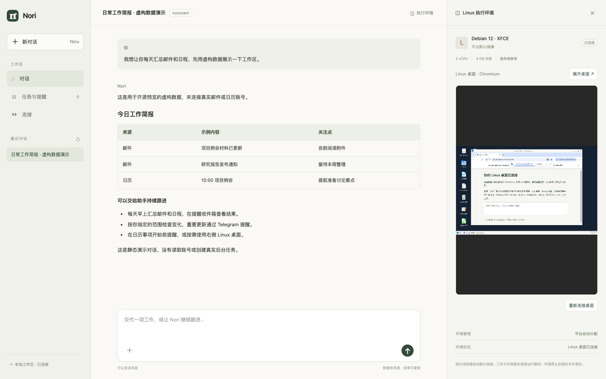

# Nori

[English](README.md) · [简体中文](README.zh-CN.md)

A self-hostable assistant inspired by **ChatGPT dots**: describe the work once,
connect your tools, and let scheduled background tasks bring results back to you.
Chat, task execution and an optional Linux desktop share one workspace.

The current focus is **ongoing personal work**—mail digests, calendar reminders
and recurring checks. Finance/crypto tools are optional extensions. The existing
`finance-agent` directory and internal identifiers remain compatible with earlier installs.

**Your ongoing work, taken care of.**

**Local alpha · Apache-2.0 · Python + Pi Agent Core + MCP**



*Actual application UI with an isolated, synthetic conversation. Mail, calendar entries and
responses in this screenshot are illustrative; no personal accounts are connected.
The application UI is currently in Chinese.*

## The workflow

1. **Describe a responsibility in chat** — for example, a daily mail/calendar digest
   or a reminder before an upcoming event.
2. **Connect the sources it needs** — Gmail and the primary Google Calendar are
   available today; administrator-configured stdio MCP servers add other tools.
3. **Let the background services run** — saved tasks run once, at intervals or daily
   while the API, worker and scheduler are online. You can close the browser.
4. **Review the result** — return to the conversation and reminder inbox, or receive
   optional Telegram notifications and signed webhooks.

Tasks are created when the user requests them. A fresh install or Google connection
never seeds recurring tasks. Google and exchange integrations are read-only.

## Inspired by ChatGPT dots

[ChatGPT dots](https://learn.chatgpt.com/docs/dots) is the primary product reference:
conversation-led work, connected tools, background follow-through and results brought
back to the user. This project independently implements an early subset of that
experience, using Pi Agent Core and a local backend. It is not affiliated with OpenAI.

Today, persistence means saved conversations, preferences, scheduled tasks and
execution results. **Autonomous goal planning, general cross-conversation memory,
self-directed wake-ups, proactive research and two-way messaging channels are not
implemented.** This is a local alpha, not feature parity with dots. Unlike a hosted
cloud agent, it stops doing work when its host or background services are offline.
See [product direction](docs/product-direction.md) for the proposed focus and gaps.

## Available building blocks

- **Chat and tools** — streaming replies, tool activity, saved conversations, Pi Agent
  Core and administrator-configured stdio MCP.
- **Background tasks and delivery** — one-off, interval and daily schedules, persistent
  execution, a reminder inbox, optional Telegram notifications and signed webhooks.
- **Google read-only connections** — Gmail search/message reading and primary calendar
  events, used by user-requested digests, monitoring and calendar reminders.
- **An optional Linux desktop** — on-demand Debian/XFCE with Chromium, LibreOffice,
  a PDF reader and file tools. Use it directly in the side panel, or let a vision-capable
  model use screenshot/computer-use tools. Chrome DevTools MCP is preconfigured.
- **Optional finance tools** — read-only Binance/OKX CLI queries and deterministic
  calculations on imported asset snapshots. They are extensions, not the main product promise.

## Quick start

Requirements: **Python 3.12+**, **uv**, and **Node 22.19+**. Docker is optional for
chat and tasks, and required for the Linux desktop. The launcher supports macOS/Linux.

Clone the repository and configure your local model key:

```sh
git clone https://github.com/xlabsg/nori.git
cd nori
cp .env.example .env
# Edit .env locally and set DEEPSEEK_API_KEY (or configure Anthropic).
uv run python scripts/dev.py
```

Open **http://127.0.0.1:8767**. The launcher installs missing Pi runtime dependencies,
initializes the database and starts the API, worker and scheduler. Press Ctrl+C to
stop them together. If the port is occupied, use `--port 8768`; optional `--data-dir`
selects an isolated database/config directory. It does not replace a running service.

Only documented model/Google settings from `.env` are loaded; the process environment
has priority. Model chat needs a key. Deterministic finance calculations and the
synthetic preview work without one. For Anthropic, set `PI_PROVIDER=anthropic` and
`ANTHROPIC_API_KEY`; `PI_MODEL` optionally selects a supported model. Desktop agent
operation needs a vision-capable model.

Optional desktop setup:

```sh
docker build -t finance-agent-desktop:local infra/desktop
```

Click **启动桌面** in a conversation. Building the image does not start a container.
See [desktop setup](docs/desktop.md) for tools, lifecycle and isolation details.

Google OAuth and Telegram are optional and require your own configuration. See
[Google setup](docs/google-setup.md) and [tasks & reminders](docs/proactive-assistant.md).

## Try a synthetic preview

```sh
uv run python scripts/demo.py
uv run python scripts/dev.py --port 8768 --data-dir .runtime/demo
```

This creates a saved, clearly labeled example conversation in a **separate database**.
It does not call a model, connect an account or create background tasks. Use a fresh
`--data-dir` if the demo already exists. To reproduce the screenshot, start the optional
desktop from this demo conversation. Interactive chat still requires a model key.

Example requests after connecting your own account:

> “Summarize my unread mail and today's calendar.”  
> “Every day at 08:30, summarize my mail and schedule.”  
> “Remind me 10 minutes before calendar events.”

## Architecture

```text
Chat workspace → FastAPI / SQLite → Pi Agent Core → tools / stdio MCP
                       ↓
                Scheduler + Worker → results / inbox / Telegram / webhook
                       ↓
                Optional Docker Linux desktop
```

The API, worker and scheduler share one Python package. Pi runs as a Node subprocess
for each conversation turn. SQLite stores conversations, tasks, results and delivery
state. Google tokens and Telegram credentials are encrypted in the local vault;
its key lives outside the repository. External content is treated as data.

## Scope and limitations

This is a **single-user local prototype**. It binds to loopback and has no workspace
login. Do not expose its API publicly. Production authentication, hosted multi-user
isolation, a remote server runner and external asynchronous analysis are not implemented.
MCP currently supports administrator-configured **stdio tools**, not remote OAuth
connectors. Calendar support reads the primary calendar. Finance monitoring of imported
snapshots repeats that snapshot; it does not imply live portfolio data.

Keep keys, inbox data, databases and logs out of Git. `.env*` and `.runtime/` are ignored;
only placeholder environment examples are published. See [Security](SECURITY.md).

## Development and documentation

```sh
uv sync --locked
npm ci --prefix services/agent-runtime --ignore-scripts
npm ci --prefix apps/web --ignore-scripts
uv run ruff check .
uv run ruff format --check .
uv run pytest -q
npm run check --prefix services/agent-runtime
npm test --prefix services/agent-runtime
npm test --prefix apps/web
uv run python scripts/check-secrets.py
```

Normal tests use fixtures and require no external credentials. Real Docker integration
checks are opt-in as described in [Contributing](CONTRIBUTING.md). GitHub Actions runs
the standard checks on pushes and pull requests. The secret-pattern check is a basic
publication guard, not a complete credential audit.

| Documentation | Content |
| --- | --- |
| [Agent runtime](docs/agent-runtime.md) | Pi, model selection, MCP and tool boundaries |
| [Tasks and reminders](docs/proactive-assistant.md) | Google monitoring, preferences, Telegram and background services |
| [Exchange integrations](docs/exchanges.md) | On-demand CLI installation and read-only queries |
| [Linux desktop](docs/desktop.md) | Image build, browser and computer use |
| [Repository layout](docs/repository-layout.md) | Module responsibilities |
| [Product direction](docs/product-direction.md) | Dots-inspired positioning, current focus and gaps |
| [Design](docs/design.md) / [Roadmap](docs/roadmap.md) | Historical finance research and deferred ideas |
| [Contributing](CONTRIBUTING.md) / [Changelog](CHANGELOG.md) | Development and release notes |

Interactive API documentation is available at `/docs` while the server is running.
The design document includes planned capabilities; it is not a claim that all are implemented.

## License

[Apache License 2.0](LICENSE). See [NOTICE](NOTICE) and
[third-party notices](THIRD_PARTY_NOTICES.md) for attribution. Dependencies and desktop
software retain their respective licenses.
