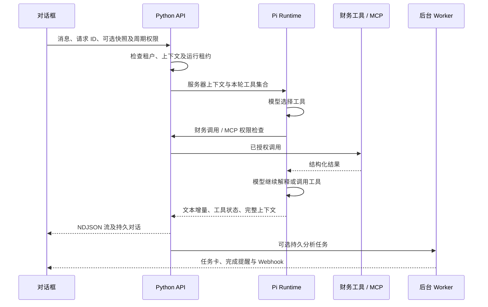

# 对话、Pi Agent 与 MCP

2026-10-01 实现决策：对话是产品主入口。用户表达目标后，Agent 在明确授权的工具集合内获取数据、调用确定性计算、提交后台任务、读取状态并解释结果。手工 JSON 表单保留为导入与调试入口。

## SDK 与职责

| 层 | 实现 | 职责 |
| --- | --- | --- |
| 对话工作台 | 同源 HTML / JavaScript | 多对话、流式回复、工具活动、关联任务卡、停止回复 |
| 会话与业务 API | Python FastAPI / SQLite | 租户认证、消息事件、上下文持久化、单会话互斥、工具权限 |
| Agent 运行时 | `@earendil-works/pi-agent-core@0.99.2` | 模型与工具执行循环、生命周期事件 |
| 模型适配 | `@earendil-works/pi-ai@0.99.2` | DeepSeek 和 Anthropic，模型由服务端 `PI_MODEL` 指定 |
| 外部工具 | `@modelcontextprotocol/sdk@1.31.0` | 管理员配置的 stdio MCP，发现并注册指定工具 |
| 财务与后台工作 | 现有 Python 模块 | Decimal 计算、持久任务、调度、提醒、Webhook |

Pi 核心提供有状态 Agent、工具执行和事件流；它不替代本产品的持久任务与权限系统。选用核心运行时，没有引入 coding-agent 的默认 shell 或文件操作工具。[Pi Agent Core 官方源码与说明](https://github.com/earendil-works/pi/tree/main/packages/agent)。MCP 客户端采用官方 TypeScript SDK。[官方 SDK](https://github.com/modelcontextprotocol/typescript-sdk)。



## 会话与运行边界

- API 创建会话，`POST /api/conversations/{id}/messages` 返回 `application/x-ndjson` 流。会话读取与工具执行都绑定当前本地工作区，模型参数不能选择 tenant。
- 每个会话只允许一个活动回复。重复 request_id 返回 409，要求重新读取会话；不会因浏览器重试重复运行模型或副作用。不同正文复用请求 ID 也拒绝。
- 每轮启动一个 Node 子进程，完成后保存 Pi 完整 transcript。界面只展示正文和工具状态，不展示模型思考、环境变量、原始异常或 MCP 完整响应。
- 每轮最多 6 次模型响应、12 次工具调用。Pi 执行超时 110 秒；API 整轮 120 秒；会话租约 130 秒。停止/断开会关闭本轮进程组及 MCP 子进程并释放租约；已经创建的持久任务独立继续运行。
- 上下文达到当前字符上限时拒绝继续并提示新开对话；还没有自动压缩或跨会话记忆。失败轮的未完成 transcript 不用于自动续跑，已持久事件和任务仍可查看。
- 本地工具：`analyze_snapshot`、`create_analysis`、`list_tasks`、`get_task`、`get_notifications`。用户明确开启本轮周期权限后才增加 `create_monitor`、`pause_monitor`；调用入口再次检查权限。
- 数据缺失需追问；附加快照为用户选择的数据，页面默认样本明确标记虚构。周期规则目前只重复固定快照。

## 模型配置与运行

需要 Node >= 22.19.0 和 Python >= 3.12：

```sh
uv sync
npm ci --prefix services/agent-runtime --ignore-scripts
uv run finance-admin init
uv run finance-admin migrate
```

在启动 API 的环境中提供 `DEEPSEEK_API_KEY`，默认 provider 为 DeepSeek，模型为 `deepseek-flash`。可显式指定 `PI_PROVIDER=anthropic`，使用 `ANTHROPIC_API_KEY` 与默认模型 `claude-sonnet-4-6`。`PI_MODEL` 选择该 provider 支持的模型；文本模型不注册桌面操作工具。不要在网页、聊天、命令历史或仓库中填写真实密钥。凭证缺失返回明确 503。

本地也可用 `FINANCE_MODEL_ENV_FILE=/path/to/model.env` 指定已有 dotenv 文件；只读取 `DEEPSEEK_API_KEY`，或官方 `api.deepseek.com` 地址对应的 `LLM_API_KEY`，不加载文件里的交易密钥等其他变量。显式进程环境优先，模型密钥只传给 Pi 子进程，不传给桌面和交易所 CLI。

API、Worker、Scheduler 启动命令见根 README。Agent 随 API 的对话请求运行，不需要第四个常驻进程。npm 安装和迁移之后需重启已启动的 API。

## MCP 配置

管理员在被 Git 忽略的 `.runtime/agent.json` 中按租户配置服务器。本阶段只有 stdio tools，不包含远程 HTTP、OAuth、resources、prompts 或通知订阅。每次对话重新读取配置、连接服务器，并仅注册 `allowed_tools`。工具别名为 `mcp_<server>_<tool>`；超过 64 字符或重复别名会拒绝配置。

示例模板见 `examples/agent-config.example.json`。将 executable 和 script 路径替换为本机绝对路径；当前本地工作区使用 `local`。附带的 `examples/mcp/snapshot-server.mjs` 只返回虚构快照，不联网、不返回真实行情。

`env_names` 是管理员允许传入该 MCP 的环境变量名称，值仅通过服务器环境注入；不可在参数、描述或响应中返回密钥。MCP 调用前向 Python 检查当前租约与该租户的工具名单。单次调用超时 20 秒，响应字符上限 100000；错误正文不透传。

MCP 程序以本机进程权限运行，尚无容器沙箱。管理员只应注册可信只读数据或分析服务；`allowed_tools` 是入口限制，不是第三方进程的系统级隔离。没有给模型开放任意 MCP 地址、安装命令或默认 shell。

## 本轮验证与尚未实现

已经用模拟 provider 验证真实 Pi 循环、Node/Python stdio、财务工具执行、持久任务和流式 API；用真实 MCP SDK 验证本地 server 的发现、调用及拒绝权限。网页完成一轮模拟模型的交互验证。已用真实 DeepSeek 验证财务计算工具；Binance/OKX 官方 CLI 公共行情查询也已实测。真实交易账户查询未配置密钥，尚未实测。

后台完成目前通过会话中的关联任务卡、全局提醒与 Webhook 返回；还没有自动唤醒模型生成后续自然语言消息。下一步是持久 Agent Run、任务完成事件驱动续跑、更多行情连接器及服务器 Runner 的受限工具适配器。它们继续使用同一工具授权入口。

## Linux 终端工具

新增 `terminal_exec`，经现有授权与运行租约检查执行真实容器命令。与侧栏用户终端共享按租户、对话隔离的工作目录与历史；命令预算和基础镜像说明见 [terminal.md](terminal.md)。Pi stdio 桥使用线程执行阻塞工具调用，不阻塞异步事件循环。

## Linux 桌面工具

`desktop_action` 观察和操作与用户共享的真实 Linux 图形桌面，截图通过 Pi 的 image content 传给视觉模型。运行参数和限制见 [desktop.md](desktop.md)。已用真实 DeepSeek Flash 验证截图识别、点击、输入与结果观察。
