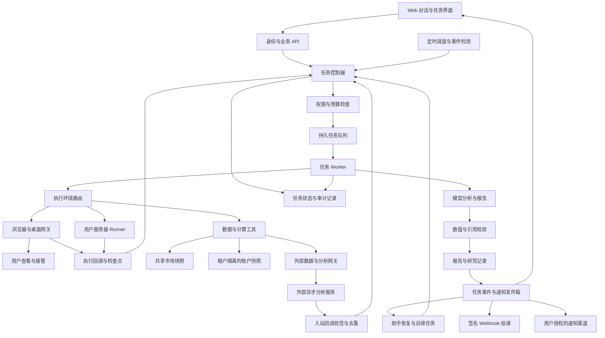

# 基于 Grok Bot 与 ChatGPT dots 的 Finance Agent 设计

> 定位更新（2026-10-01）：本稿保留最初的 Finance 产品假设和竞品调研。
> 当前主要对齐 ChatGPT dots 的持续工作助手体验，Finance 为可选扩展；
> 当前方向以 [产品方向](product-direction.md) 和 README 为准。

调研日期：2026 年 10 月 1 日。版本：产品与技术设计第三稿，加入回调、提醒、外部分析、服务器接入及 Browser 与 Computer Use。核心对标：Grok Bot、ChatGPT dots。

建议做一个以 crypto 为首个领域的 Finance Agent：用户把一个持续的财务研究或资产监控目标交给它，它记住范围与偏好，在后台获取数据、计算、核验和跟进，交付可追溯的结果，并在需要用户判断时发起询问。

首版选择「个人 crypto 投资者的研究与资产关注助手」。主体验是一个长期助手、持续任务、证据卡片和任务收件箱；主要付费价值是减少重复研究和漏看重要变化。该定位、定价与用户需求仍是待验证假设。

本轮是官方资料与公开产品文档调研，未登录两个产品完成实测，不能据此评价实际准确率、稳定性或收益表现。竞品能力与本产品的设计建议在下文分别标明。

## 对标对象与研究发现

这里的 Grok Bot 指 x.ai 的持久化工作 agent，ChatGPT dots 指 OpenAI 的 always-on agent；不把普通 Grok 聊天或其他名为 Dot 的应用混在一起。

Grok Bot 官方文档说明：Bot 有长期角色和上下文，能使用云端电脑、浏览器、文件与终端，也能通过连接器完成工作；多个 Bot 可协调任务。其工作方式是把任务交给一个可以持续跟进的 AI 同事。[Grok Bot 官方概览](https://docs.x.ai/grok-bot/overview)

ChatGPT dots 官方文档说明：dot 在云端持续工作，利用对话、相关 ChatGPT memory 和自身笔记保持上下文；用户可在它工作时继续交流，它能通过后台任务推进工作并带回结果。[Meet dots](https://learn.chatgpt.com/docs/dots)

| 观察维度 | Grok Bot 的公开能力 | ChatGPT dots 的公开能力 | 对 Finance Agent 的设计启发 |
| --- | --- | --- | --- |
| 产品主体 | 多个有名字和职责的 Bot | 同一个持续跟进工作的 dot | 首版一个助手，由它负责结果 |
| 工作环境 | 持久云端电脑和连接器 | 云端电脑和连接的工具 | 金融数据优先走结构化工具 |
| 连续性 | 保存角色与工作上下文 | 使用记忆和任务笔记 | 保存投资偏好与研究进度 |
| 自动化 | skill 描述方法，routine 定时或按支持的事件运行 | 保存周期任务，支持部分服务事件 | 自然语言任务必须落成可检查的规则 |
| 用户介入 | 展示待批准的具体操作 | 在权限与审查规则下请求用户判断 | 权限、暂停和运行记录做成产品功能 |

自动化行分别依据 [Grok Bot skills 与 routines](https://docs.x.ai/grok-bot/skills-routines-and-automations) 和 [dots tasks 与 memory](https://learn.chatgpt.com/docs/dots/tasks-and-memory)。表中最后一列都是本设计的推论。

公开资料揭示的是交互和能力边界，未揭示完整内部架构。下文的调度、存储、模型路由和计算方案是我们自己的实现建议，不应当称作对竞品内部系统的复刻。

## 从通用 Agent 收敛到 Finance

可以继承的体验是：自然语言设定目标、持续上下文、后台跟进、可复用方法、阶段成果与用户介入。Finance 场景还需要补齐资产身份、数字计算、来源时效、账户隔离和财务口径。

关键产品差异应落在四个结果上：

1. 每项重要数值有来源、时间、单位和计算口径，用户能够复核。

2. 一个研究问题可以跨天跟踪，后续更新指出原判断的哪些证据发生了变化。

3. 变化与用户的自选、持仓和研究目标关联，用户收到的是与自己相关的提醒。

4. 任务能解释当前状态：上次成功、数据缺失、等待用户、何时再运行及如何停止。

通用 agent 加金融工具已能覆盖很多问答。OKX 已公开提供包含行情和账户能力的 Agent Trade Kit；Nansen 也提供链上数据 MCP。这说明「能查 crypto 数据」本身不足以形成产品优势。[OKX Agent Trade Kit](https://www.okx.com/docs-v5/agent_en/)，[Nansen MCP](https://docs.nansen.ai/mcp/overview)

本设计的竞争假设是：经过校验的数据与计算、持续跟踪的研究对象、低噪声提醒和可靠执行记录，能让用户愿意持续付费。这个假设需要通过试用对比验证。

## 首批用户与核心场景

先服务有自选资产、会主动研究、希望持续关注市场的个人 crypto 投资者。假设其已理解基本风险，愿意为节省时间付费。暂不同时覆盖家庭预算、企业财务、高频交易与机构级全链研究。

| 用户任务 | 用户输入示例 | 系统交付 | 频率 |
| --- | --- | --- | --- |
| 自选晨报 | 每天北京时间 8 点，只告诉我 BTC、ETH、SOL 值得关注的变化 | 与上次报告比较的简报，附数据时间与来源 | 每日 |
| 研究跟踪 | 未来两周跟踪 ETH 这几个论点，证据明显变化时告诉我 | 研究卡、支持与反对证据、变化记录 | 每日核查加事件触发 |
| 资产风险关注 | 我导入了持仓，单币占比超过我设的阈值时提醒 | 占比计算、触发原因、对应账户、数据覆盖 | 定期 |
| 按需解释 | 今天我的资产为什么变化这么大 | 价格贡献与资金流贡献，无法确定的部分单列 | 按需 |
| 定期复盘 | 每周总结本周新增证据和我做过的决定 | 研究与决策时间线，未解决问题 | 每周 |

首个演示闭环：创建自选 → 设定晨报 → 获取当前事实 → 产生首份报告 → 模拟一个满足条件的变化 → 收到有依据的提醒 → 用户修改规则 → 再次运行确认变化。

持仓导入采用渐进方式：用户可先只用自选；随后选择手工数量或导入记录；需要自动同步时再连接只读账户。首次使用就要求账户密钥会增加验证产品价值的门槛。

## 产品界面与交互

首版采用响应式 Web，桌面便于研究，移动端便于查看提醒。保留一个默认助手和五个入口：对话、今日收件箱、持续任务、资产与研究、连接与执行环境。

对话用于交代目标和追问。收件箱汇总报告、重要变化、数据故障与待决事项。持续任务显示规则、下次运行和历史结果。资产与研究页面让用户查看当前事实及过去判断。助手的名字和形象可以轻量提供，但不应延迟上述核心流程。

用户说「帮我关注 BTC，有重要变化提醒」时，系统需要把模糊要求具体化：资产、时间窗口、指标、阈值、通知方式、数据来源、结束条件。提供可编辑的建议值，并在启用时显示任务卡。

任务卡示例，以下全部为产品演示参数：

- 资产：BTC，指定行情来源与交易对。

- 检查：每 5 分钟；北京时间 08:00 生成每日摘要。

- 触发：24 小时跌幅达到用户选择的 5%。

- 通知：站内即时提醒；可选连接 Telegram 后推送。

- 抑制：同一事件 6 小时内不重复，风险继续升级可另行提醒。

- 时效：超过该指标允许的最大数据年龄，暂停价格判断并报告数据异常。

- 期限：持续运行，用户可随时暂停；下次运行时间可见。

确认是为了定义持续任务的规则和资源消耗；已经启用的只读任务在授权范围内自动运行，无须每次询问。

提醒卡包含：发生了什么、为何与你相关、证据与时间、哪些解释仍不确定、查看详情、修改阈值、暂停。例：「触发你设置的 BTC 跌幅规则，可能影响你导入的 BTC 敞口。价格数据截至……；这条提醒只确认价格变化，暂未核实其原因。」

任务暂停、通知静音和删除数据是三个独立动作。静音仍继续计算；暂停停止新运行；删除按保留与审计规则处理。界面必须说明各动作的实际效果。

## MVP 范围与迭代顺序

| 阶段 | 功能 | 验收要点 |
| --- | --- | --- |
| P0 闭环 | 一个助手、对话、自选、简报、定时与事件提醒、任务回调、站内及一个外部通知渠道 | 任务自动跟进，回调可去重，通知可追踪与撤销 |
| P0 可信度 | 标准资产标识、结构化数据、确定性计算、时效检查、故障展示 | 关键数字可重算，缺失不能变成零 |
| P1 个性化 | 手工持仓与导入、一个交易所只读同步、持仓风险提醒、研究跟踪 | 单个账户数据故障不会被合并结果掩盖 |
| P0 扩展 | CSV 与 JSON 导入、一个只读外部数据连接器、一个异步分析服务适配器 | 版本固定、结果可复核，回调失败可补偿 |
| P1 执行 | 一个 Linux Runner、云端浏览器、人工接管、受限桌面试点 | 断线与取消可恢复，操作和产物可核验 |
| P2 扩展 | 稳定币收益研究、链上持仓、团队协作、更多资产类别 | 只有首批使用与付费成立后扩展 |

首版不纳入自动下单、资金转移、私钥托管、全市场智能荐币与自由安装第三方技能。浏览器和桌面支持经授权、按工作流验收的网站与分析应用。自动交易改变权限、成本和验证要求，应作为单独版本评估。

稳定币收益研究适合作为第二个垂直方向：比较收益组成、期限、可用规模、历史波动、平台与协议风险。收益展示必须拆开实际收益、当前报价与模拟年化。首版先让用户形成「它确实持续帮我看事情」的使用习惯。

## 对话优先与 Agent SDK 的实现决策（2026-10-01）

实现以 Chatbox 为主入口：消息、流式回复、工具活动与关联任务卡在同一对话里展示。导入表单只承担快照上传与调试。Agent 使用 Pi Agent Core 与 pi-ai，外部工具使用官方 MCP TypeScript SDK；Python 继续负责财务计算、权限、任务、调度、通知与 Webhook。

当前已实现的 Node 运行时按轮启动，通过私有 stdio 调用 Python 工具。MCP 暂支持管理员按租户配置的 stdio 白名单；模型没有默认 coding-agent shell。会话持久化、互斥、请求去重、工具预算、超时及停止已加入。首个模型 provider 为 Anthropic。

这不表示后续规划已全部完成：实时数据、Browser、Computer Use、Runner、后台事件唤醒模型及长期记忆仍待实现。当前后台完成返回任务卡与提醒。具体 SDK 版本、配置和验证边界见 [Agent 运行时说明](agent-runtime.md)。下面 PostgreSQL、Redis 与常驻任务恢复等内容仍是完整产品的目标架构。

## 运行机制与技术架构

建议采用模块化单体服务、独立 worker 和共享数据采集层。前端用 TypeScript Web 框架，后端与金融计算用 Python，PostgreSQL 保存业务状态，Redis 提供队列和限流，对象存储保存原始证据与报告。具体框架选型在实现前按团队已有能力确认；首版不需要一套复杂微服务。

24 小时可用指系统能够按规则唤醒与跟进。市场采集和阈值检测使用普通程序，只有触发分析、每日摘要或用户提问时调用模型。避免给每个用户每分钟运行一次完整 LLM，也避免为每个用户重复采集同一公开行情。

模型负责编排已允许的工具、解释事实和写报告；数值计算、权限检查、任务状态转换与通知投递由程序负责。浏览器与桌面执行由独立网关提供，支持允许的网站与分析应用；真实金融账户通过只读连接器访问。服务器 Runner 运行已登记任务，各执行路径共用权限与回调机制。

任务状态至少包括：scheduled、queued、running、waiting_user、succeeded、partial、failed、paused、cancelled；外部异步分析增加 waiting_external。持续任务的配置与一次运行的状态分开保存；某次成功不表示监控永远正常。

调度用数据库保存下一次触发时间和配置版本。Worker 获得有期限的运行租约并定期续约，超时可恢复。采用至少一次投递加幂等键；通知通过事务发件箱，投递后记录渠道回执。重复调度只能产生一个对应结果与通知。

暂停会使待运行任务失效，并通知运行中的 worker 在检查点退出；报告发布与通知发送前再检查配置版本和暂停状态。用户在任务工作时发送新信息，系统保留当前运行版本，并将新规则用于后续运行；若需取消当前工作，提供明确控制。

## 任务回调与后续跟进

回调是首版核心能力，分为三个层次：任务事件唤醒助手、结果通知用户、Webhook 通知用户授权的外部系统。通知已送达、用户已查看和业务已完成分别记录，不能互相替代。

| 事件 | 助手行为 | 用户或外部系统收到的内容 |
| --- | --- | --- |
| task.started | 记录运行状态，长任务按需更新进度 | 开始时间与任务链接 |
| task.progress | 合并进度，限制频率 | 已完成阶段、下一步及已知阻塞 |
| task.succeeded | 核验结果，恢复父任务并生成结论 | 结果摘要、证据与成果链接 |
| task.partial | 保存可用结果，说明缺失 | 已完成部分、影响及可选补救 |
| task.failed | 分类错误，按规则重试或停止 | 失败原因、重试状态和所需动作 |
| task.waiting_user | 保存检查点，暂停依赖该输入的步骤 | 具体问题、选项及回复入口 |
| task.cancelled | 停止后续执行与结果发布 | 取消状态及已产生的成果 |

任务完成后由事件处理器把结果送回同一个助手与父任务；用户不必重新询问「做完了吗」。助手根据预先设定的目标继续下一步，重新检查范围与预算。回调事件不能自行授予下单或其他新权限。

事件在保存业务结果的同一数据库事务中写入发件箱。事件字段包含 schema_version、event_id、event_type、tenant_id、task_id、run_id、parent_task_id、sequence、occurred_at、config_version 和 result_ref。event_id 用于去重，sequence 用于同一运行的顺序判断；系统允许重复或乱序投递，但不允许旧事件覆盖新状态。

Webhook 使用预登记并验证的 HTTPS 地址。签名绑定时间戳与原始请求体，接收方核验签名、时间窗口和 event_id。签名密钥支持轮换，不写入聊天。回调默认只带必要状态与摘要，完整私有成果通过租户授权接口获取。

建议首版投递参数：单次超时 10 秒，指数退避并加入随机抖动，最多重试 8 次且不超过 24 小时，任一上限达到后进入失败队列。成功的 HTTP 2xx 只表示接收方接收事件；不表示它完成业务处理。接收方应先持久化并去重，再快速确认接收。人工重放保留原 event_id，投递尝试另有 attempt_id。

拒绝私网、环回和云元数据目标；每次请求及重定向重新检查目的地址，避免登记后地址解析变化绕过限制。回调端点失效不影响任务结果保存，用户仍能在站内查看并修复地址。

等待用户的任务保留 checkpoint_ref 和输入版本。回复入口绑定用户、任务和问题；授权与有效期检查通过后从检查点恢复。过期回复、重复回复和已取消任务不得再次唤醒。未收到用户输入时按已配置的截止规则提醒或暂停，不把超时视为批准。

## 自动提醒与主动任务

提醒覆盖时间、数据变化、业务事件与任务状态。用户可以用自然语言定义规则，系统保存为结构化 Monitor，并显示下次检查、来源、作用范围、结束时间和通知渠道。

| 触发类型 | 示例 | 规则要求 |
| --- | --- | --- |
| 固定时间 | 每天 8 点生成自选简报 | 时区、节假日策略、错过运行的处理 |
| 指标阈值 | 单币占比超过用户设定的上限 | 数据时效、阈值、持续时间与恢复条件 |
| 相对变化 | 收益报价较昨日下降超过用户选择的幅度 | 基准快照、比较窗口、最小样本覆盖 |
| 业务事件 | 数据源发布相关公告，外部分析产生新结果 | 事件认证、资产匹配与事实核验 |
| 任务生命周期 | 报告完成、任务失败或等待输入 | 接收人、严重程度、超时和升级规则 |

统一通知中心管理站内通知及用户连接的外部渠道。首版提供站内加一个外部消息渠道；Webhook 面向系统集成，消息渠道面向人。Webhook 投递失败与消息发送失败分别处理。

提醒规则包含 quiet_hours、digest_policy、cooldown、rearm_condition、max_notifications 和 escalation_policy。日常提醒在安静时段进入待发送摘要；用户显式开启的紧急类别按规则即时发送。超额事件保留在站内并说明聚合数量，不能无声丢弃。

用户可设置「只提醒」「提醒并生成分析」「完成分析后跟进研究卡」。第三种会创建有预算限制的后续任务，记录根事件和任务依赖；限制链路深度和重复触发，避免结果回调再次触发原分析形成循环。

检测逻辑持续运行，模型只处理需要解释的事件。开启规则后提供试运行，展示历史或模拟输入为何触发，明确区分模拟提醒与真实市场提醒。首页提供暂停全部自动任务和撤销渠道授权的入口。

## 外部数据与分析扩展

外部扩展同时支持数据接入和分析执行。用户可以加入自己的记录、授权数据服务，或调用已有分析程序，助手负责校验输入、跟进执行和把结果纳入研究流程。

| 扩展形式 | 输入或能力 | 集成方式 |
| --- | --- | --- |
| 文件数据 | CSV、JSON，后续支持 Excel | 上传、列映射、预览及数据质量检查 |
| 外部数据源 | 只读 REST API、数据库视图、MCP 数据工具 | 连接器注册、凭证引用与权限范围 |
| 内置分析 | 汇总、分组、时间序列、风险与收益计算 | 版本化确定性函数 |
| 外部分析服务 | 用户已有 Python 服务、研究服务或回测引擎 | 受审核的 HTTP 分析任务接口，支持异步回调 |
| 自定义分析代码 | 高级用户提供的分析脚本 | 后续在隔离沙箱中执行，明确资源与输出限制 |

首版提供 CSV 与 JSON 导入、一个受审核的外部只读数据连接器、一个外部异步分析服务适配器。保留 REST 与 MCP 扩展接口，更多数据库类型与任意代码执行放在后续版本。首版连接器由管理员审核注册，用户配置参数和授权。

连接器登记清单包含 connector_id、version、输入与输出 schema、资产与单位定义、时间字段、权限范围、刷新能力、行数和请求限制、数据来源与商业使用限制。分析工具额外声明方法版本、参数、计算口径、最长运行时间和费用上限。模型只能调用当前租户允许的工具，不能动态安装外部代码。

分析请求标准字段：analysis_id、idempotency_key、dataset_ref、dataset_version、method、method_version、parameters、as_of、budget 和 callback_binding。callback_binding 由服务端生成并绑定该运行，不能由模型传入任意回调 URL。外部服务可立即返回结果，或返回 job_id 表示接收，任务进入 waiting_external 状态。

外部分析完成后调用入站回调接口；签名或服务身份认证必须绑定连接器、租户和 job_id。校验事件去重、结果 schema、原任务状态、数据集版本和取消状态后，才允许恢复任务。支持轮询作为回调缺失时的补偿；提交超时后先按幂等键查询，不能直接重复创建可能收费的分析任务。

结果契约包含 status、metrics、tables、artifact_refs、evidence_refs、method_version、data_window、coverage、warnings、cost 和 completed_at。产物引用只能指向已授权存储，返回内容限制大小和格式。外部工具的自然语言输出也属于外部数据，不改变助手权限。

接入数据前检查币种、单位、日期与时区、重复行、资产映射及时间缺口。保留原始文件及清洗版本，预览排除与修正的记录。运行记录固定数据快照、参数和工具版本，保证结果可复现。外部回测必须标明成本与样本口径，再纳入报告。

完整示例：「用我上传的成交记录做周度收益归因，每周一 9 点刷新；完成后更新研究卡并提醒我。」流程为导入预览 → 保存规则 → 生成数据快照 → 提交分析 → 验证回调 → 核验结果 → 更新研究卡 → 自动通知。用户在执行期间可以继续交流，助手保留原任务身份和进度。

## 回调与扩展的验收

新增核心检查：重复与乱序回调只更新一次有效状态；旧版本和已取消任务不能被回调恢复；外部提交超时不会重复收费；无回调时能轮询补偿；连接器撤销后停止后续调用；签名错误与跨租户回调被拒绝；等待用户回复能从检查点继续；安静时段和提醒升级符合规则。

记录任务计算耗时、外部等待时间、回调成功率与延迟、重试与失败队列数量、消息渠道投递状态、外部分析成本。对用户分别显示「分析完成」「通知已投递」「外部系统已接收」，不承诺跨所有外部系统的绝对一次执行。

## 服务器接入与执行环境

服务器接入按「用户已有计算或数据服务器接入任务执行」设计，同时支持平台托管的云端运行环境。它与外部 HTTP 分析服务并列：外部服务暴露已有能力，服务器 Runner 在授权工作目录执行已登记的分析任务。

| 执行环境 | 适用任务 | 首批能力 |
| --- | --- | --- |
| 平台工具 Worker | 数据查询、计算、报告与提醒 | 默认执行路径 |
| 云端浏览器 | 公告检索、网页研究、授权报表下载 | 独立会话、截图、下载与人工接管 |
| 云端桌面 | 无结构化接口的桌面分析应用 | 有界点击、键盘输入和结果验证 |
| 用户服务器 Runner | 私有数据分析、长时计算、已有研究程序 | 登记任务、参数化运行、日志与产物回传 |
| 用户本地电脑 | 只能在本机运行的工具和文件 | 后续连接，在线时执行，不自动等同于服务器授权 |

首版建议接一个 Linux Runner；Windows 与用户本地桌面在后续验证，不预设用户已经有合适服务器。Runner 安装后通过出站加密连接领取任务，采用短期服务凭证和设备绑定；平台无需默认暴露用户服务器的 SSH 或远程桌面端口。

SSH 可作为管理员选用的兼容接入方式，通过专用执行账号、主机身份验证和受限命令封装执行登记任务。首版不向模型提供不受限制的 SSH shell、root 权限或 Docker 管理套接字。用户需要通用运维能力时，另建执行权限类别与可审核流程。

执行配置固定 runner_id、租户、工作目录、命令模板、参数 schema、允许的数据集、网络目标、资源上限和最大时长。命令以可执行程序及参数数组传递，避免把模型文本拼接成 shell 命令。模型可选择已批准任务与参数；增加程序、扩大目录或改变权限需要重新授权。

Runner 协议统一 run_id、配置版本、幂等键、租约、心跳、检查点、取消信号、日志和产物清单。长任务脱离浏览器与聊天会话继续运行，成功或失败后进入同一任务回调流程。断线标记执行状态未知，重连先查询原任务，不能直接重复启动。

暂停或取消后控制器撤销租约，Runner 停止子进程并清理临时资源；平台网络隔离下无法立即停止远端进程时，应显示停止待确认。需要严格停止边界的任务使用短租约和心跳失联自停。结果上传必须重新验证任务与授权状态。

用户服务器遵守该服务器管理员配置的边界，不声称平台能对用户自有 root 环境提供完整隔离。平台托管的第三方代码及桌面会话则采用 VM 或 microVM 级隔离；仅浏览器 profile 隔离不足以承担租户安全边界。

## Browser 与 Computer Use

能力选择顺序为结构化接口、浏览器页面结构、视觉浏览器操作、桌面视觉操作。API 数据便于核验；页面结构用于定位元素与提取表格；画布、复杂控件或桌面应用才交给视觉操作。每次切换仍沿用任务身份、来源记录和权限检查。

浏览器工具支持导航、读取当前页面、定位与操作元素、分页与多标签、截图、下载和产物保存；桌面工具支持截图、鼠标键盘、窗口切换及受限文件操作。每一步采用「观察 → 检查目标与权限 → 执行 → 再观察验证」循环，不能只因点击没有报错就认定任务完成。

Playwright BrowserContext 可分离 cookie 与本地存储，可用于会话划分；其官方说明针对浏览器上下文隔离。本设计另加操作系统与网络层隔离来保护不同租户，不能将上下文分离当成完整的恶意代码隔离。[Playwright 上下文隔离](https://playwright.dev/docs/browser-contexts)

对需要长期登录的分析网站，按租户、身份和权限配置保存加密会话，任务通过独占租约借用会话，禁止多个任务同时操控同一桌面。截图、录像和下载可能包含私有资料，限制访问与保留时间；登录接管阶段不把凭证画面送入模型或普通录屏。

遇到登录、MFA、验证码、权限变化或无法判断的界面，任务进入 waiting_user，显示当前页面与需要用户完成的步骤。用户通过远程查看接管；接管期间助手暂停输入，归还后重新观察并检查页面状态再继续。不要通过自动化绕过验证码或网站访问限制。

操作前检查域名、应用、页面状态和动作类别，下载后校验文件内容、格式与大小。首版使用允许的网站和应用清单，每个任务限制步骤、时间、下载量与费用。连续操作无进展时停止并提供当前截图与原因，避免无限循环。

禁止金融交易动作必须覆盖所有执行路径。交易所只读 API 的限制不会限制另一个拥有完整账户权限的网页登录会话。因此首版不接管可交易或转账的真实账户网页登录；账户研究通过只读连接器或经脱敏的报表完成。非交易分析网站可按授权接入。未来开放交易界面前，需要独立验证动作控制与资金权限。

Grok Bot 官方安全说明也提示连接器政策与网络政策属于不同层次。这支持我们的设计取舍：禁用一个工具时，应同步检查浏览器、终端和网络是否仍可绕过同一权限边界。[Grok Bot 安全说明](https://docs.x.ai/grok-bot/security-faq)

## 执行路由与完整演示

用户提出目标后，控制器选择可满足任务的执行环境，展示执行位置、数据范围、预计费用与是否需要用户介入。自动任务在用户已授权的配置内继续执行，新增服务器、身份或权限时才重新确认。

完整演示：「每周从我授权的研究网站下载报表，结合服务器上的成交数据做收益归因，完成后通知我。」

流程：调度唤醒 → 浏览器读取授权页面并下载 → 校验和登记文件快照 → Runner 在允许目录执行分析 → 回传结果与证据 → 回调恢复助手 → 核验口径并更新研究卡 → 站内和外部渠道提醒。网站会话失效时先等待用户接管，服务器离线时保存等待状态；两个故障都保留任务身份。

界面增加「连接与执行环境」入口，显示服务器在线状态、会话、授权范围与撤销。任务详情显示工具调用、网页步骤、服务器运行记录、回调投递和产物。提供独立控制：接管当前会话、停止当前执行、暂停周期规则、撤销连接。

新增验收用例：服务器断线和重连不重复运行；取消后迟到回调不恢复任务；浏览器登录接管后可继续；同一会话并发任务排队；页面布局变化时明确失败；下载内容与声明不符时拒绝；浏览器与终端不能绕过被撤销的数据权限。

## 扩展执行能力的交付安排

回调、提醒与外部分析保留在 P0。服务器 Runner 和云端浏览器列为 P1 重点；桌面视觉操作先做受限场景试点，再决定扩展范围。具体支持的网站和桌面应用必须按工作流验收，不承诺任意网站或应用均可稳定自动化。

在两名工程人员的规划假设下，第 1 至 8 周完成基础闭环，第 9 至 10 周接入一个 Linux Runner 与云端浏览器，测试接管和恢复；第 11 至 12 周验证一个桌面应用场景，并完成跨执行路径的权限、故障与成本评测。完整能力试点调整为约 12 周，仍受认证接入和网站兼容性影响。

执行成本新增浏览器与 VM 占用时间、Runner 管理、截图与产物存储、视觉模型调用及远程会话流量。默认按需启动，空闲休眠，必要时只保留加密会话；专业版提供明确执行分钟与分析额度，持续占用桌面作为独立付费选项。原 19 美元订阅的演示成本不含这些新能力，必须重新测算。

## 数据来源与资产模型

优先接入少量可以核验的来源，逐步验证覆盖与授权。以下为候选方案，不表示已经采购或确认商业展示权。

| 数据类型 | 候选来源 | 首版用途 | 主要限制 |
| --- | --- | --- | --- |
| 交易所行情 | OKX 公共行情接口 | 价格、K 线、成交量和可选衍生品指标 | 单交易所口径，账户地区和接口限制需核对 |
| 资产元数据 | CoinGecko | 资产身份、分类、汇总市场信息 | 商业许可、缓存与再分发条件需逐项确认 |
| 账户数据 | 一个交易所只读 API，或用户导入 | 持仓、账户快照与资金流 | 权限、历史覆盖、资产估值需检查 |
| 协议与稳定币数据 | DefiLlama | 后续 TVL、收益与稳定币研究 | 端点口径、刷新周期及许可需确认 |
| 链上标签 | Nansen 等付费来源 | 后续地址研究 | 采购成本、标签误差与身份推断限制 |
| 新闻与公告 | 项目官方公告、协议文档、允许的新闻来源 | 核查资产相关事件 | 转载并非独立证据，社交帖子可能未证实 |

上述接口能力依据 [OKX 工具说明](https://www.okx.com/docs-v5/agent_en/)、[CoinGecko API](https://docs.coingecko.com/)、[DefiLlama API](https://api-docs.defillama.com/) 和 [Nansen MCP](https://docs.nansen.ai/mcp/overview)。接口可用与数据商业使用权是不同问题。社交平台的接入、预算和授权未在本轮确认，不把实时 X 数据写成首版承诺。

资产不能只用 ticker 识别。中心化交易所工具使用 exchange、instrument_id、instrument_type、base、quote；链上资产使用 chain_id、contract_address，并通过受审核的映射关联 canonical_asset_id。同名代币、包装资产、桥接资产保持差异。

每条事实至少保存 source、source_record_id、asset_id、observed_at、fetched_at、value、unit、quality_status；链上记录另存区块和确认状态。采用 UTC 存储，按用户时区展示。精度使用 Decimal 或等价定点表示。

时效采用指标级配置：演示目标可设行情最大年龄 2 分钟、账户快照 10 分钟，公告按原始发布时间显示。最终阈值取决于实际提供商刷新能力。超过阈值显示 stale，接口失败显示 unavailable；不得沿用旧数字却标成当前值。

## 金融计算与证据规则

财务结果必须来自可重算函数。模型接收已计算的指标及定义，并用结构化输出关联事实 ID；重要数值没有匹配事实或计算结果时，校验器要求重写或隐藏该部分。

首版对现货持仓采用明确的估值价格。已估值资产占比 = 该资产价值 / 已估值资产总价值，同时显示未估值资产与覆盖情况。部分覆盖时不得将结果描述为完整账户占比。对于衍生品，净资产、名义敞口和抵押品分开；缺少合约乘数或反向合约规则时禁用相关计算。

期间收益额可定义为：期末权益 − 期初权益 − 外部净流入。外部净流入 = 入金 − 出金；自己的账户之间转账在合并视角消除。交易手续费与资金费按账单分类归集，明确采用的计价币和换算时点。缺少历史账单时只展示当前权益和有覆盖的区间，不构造完整收益。

净值或收益率需要处理现金流时点；首版未验证前不显示精确的时间加权收益率。用户想看复盘时，可先给权益变化和已知现金流。后续若加入回测，必须包含成本、样本时间、覆盖与样本外结果，不能直接转成实盘建议。

每份研究报告分成「事实」「可能解释」「待核查问题」。来源之间口径不一致时分别列出。价格上涨与某条新闻同时发生只能说明时间相关，不能据此认定因果。

置信度使用可解释的标签，例如「官方原始来源已核查」「多源口径存在冲突」「单一未证实来源」。不要由模型随意给出 87% 之类看似精确的概率。

## 持久记忆与业务对象

持久记忆分三层：

- 用户偏好：关注范围、语言、时区、研究期限、提醒习惯。用户可查看和修改。

- 业务状态：当前研究论点、任务配置、待核查问题、用户确认过的决定。

- 动态事实：账户与市场快照，通过时间和来源引用；每次重要判断重新取数。

用户说「我最近想减少风险」可以作为待确认偏好；不能自动转化为账户调仓权限。研究过程中从网页看到的指令不进入用户偏好或授权。记忆记录包含来源、创建时间、适用范围、过期时间和更正版本。

| 对象 | 关键内容 |
| --- | --- |
| UserProfile | 时区、语言、展示与通知偏好 |
| AccountConnection | 账户别名、权限状态、密钥引用、连接健康 |
| PortfolioSnapshot | 账户与资产、估值、时间、覆盖和异常 |
| Watchlist | 标准资产标识、用户关注原因 |
| ResearchCase | 论点、证据、反证、期限、状态和版本 |
| Monitor | 规则、来源、频率、时区、预算、通知策略 |
| Run | 配置版本、状态、工具调用、成本、检查点、父任务及结果引用 |
| Evidence | 原始来源、事实与时间、内容摘要、存储引用 |
| Notification | 去重键、严重程度、渠道、投递状态和反馈 |
| TaskEvent | 事件类型、运行序号、版本、结果引用和回调投递 |
| Connector | 数据与分析协议、版本、权限范围和凭证引用 |
| AnalysisJob | 外部任务标识、数据快照、方法参数、状态与成本 |
| ExecutionEnvironment | 环境类型、设备身份、授权范围、状态与资源预算 |
| BrowserSession | 站点与身份、加密会话引用、租约、接管及过期状态 |

所有私有对象带 tenant_id，并在服务与数据库层强制授权。研究卡保存更正历史，避免新报告覆盖旧判断而无法复盘。用户可导出任务、研究和记忆；删除需要同时处理向量索引、缓存和备份保留策略。

## 权限与运行边界

这是本产品的权限设计建议，参考了两个竞品的权限交互，但采用针对金融场景的确定性限制。[Grok Bot approvals](https://docs.x.ai/grok-bot/approvals-security-and-privacy)，[Control your dot](https://learn.chatgpt.com/docs/dots/controls)

| 动作 | 首版策略 |
| --- | --- |
| 读取公开资料、计算和保存私有报告 | 在用户任务范围与预算内自动进行 |
| 持续监控、读取账户与外部通知 | 用户启用规则或连接时授权，可随时撤销 |
| 修改提醒或研究偏好 | 展示具体变化并保存版本 |
| 分享私有报告或向第三人发送内容 | 明确目标、内容和范围后批准 |
| 下单、转账、提现、修改交易权限 | 首版工具与服务端均不提供 |

OKX 官方区分 Read、Trade 与 Withdraw 权限，其中 Trade 还包含部分资金划转和设置操作。因此「没有 Withdraw」不等于纯只读；账户连接必须验证为 Read，并用服务端工具白名单二次限制。[OKX API 权限](https://www.okx.com/docs-v5/en/)

密钥通过专用连接表单进入加密凭证库，只把引用交给工具服务；不进入聊天、模型提示词和普通日志。MCP 是工具接入协议，不能代替权限检查。撤销账户连接后停止相关任务并废止服务端会话。

网页、公告、上传文件与第三方工具结果属于外部数据，不得改变工具权限。工具参数校验目标租户、账户和资产；任意 URL 抓取限制域名、重定向、内部网络和响应大小。计算沙箱限制网络、时间和文件访问。

本产品支持云端浏览器、受限桌面与服务器执行。凭证和数据按租户及授权身份隔离，运行环境按需启动；多个助手角色不构成权限隔离层。相关能力的详细边界见服务器接入及 Browser 与 Computer Use 章节。

## 提醒质量与可观察性

采用「原始变化 → 规则触发 → 用户相关性 → 事实核验 → 去重与分级 → 投递」流程。固定价格规则由程序检测；模型解释不能延迟确定性风险提醒，解释失败时也应交付已核实的触发事实。

日常变化放入摘要；达到用户阈值的事件即时提醒；明显升级或用户选择的高优先级风险允许突破日常消息上限。每条提醒支持「有用」「重复」「不关心」反馈，记录反馈用于调整规则建议，不能无声修改用户设置。

去重键结合租户、监控规则、资产、事件类型和事件窗口。加入冷却时间与恢复条件，避免价格在阈值附近波动反复触发。公告转载聚合为一个事件，不能把十个转载计为十份独立确认。

运维指标同时检查队列积压、任务心跳、上次成功采集、各账户数据年龄、计算覆盖和通知回执。服务进程健康不能代表某个用户的监控有效。核心页面应显示最近成功与最近错误。

遇到故障时按影响降级：公共行情缺失时暂停相关阈值判断；账户失效时仍可生成公共自选报告，但持仓分析明确不可用；模型超时保留事实卡；渠道失败保留站内结果并受控重试。所有重试计入预算并限制次数。

## 商业模式与成本假设

先验证订阅意愿，初期不以交易返佣作为主要收入，避免提醒质量与交易频率之间出现利益冲突。以下数字都是用于实验的建议，非竞品报价、供应商报价或收入预测。

| 方案 | 建议价格实验 | 包含范围 |
| --- | --- | --- |
| 试用 | 7 至 14 天 | 少量自选、一项持续任务、每日摘要 |
| 个人版 | 15 至 25 美元每月 | 多项监控、研究卡、标准报告额度 |
| 专业版 | 39 至 59 美元每月 | 只读账户、更高研究额度、导出与通知 |
| 团队版 | 后续测试 | 共享研究、角色权限与团队管理 |

先提供明确的报告和监控额度，不承诺无限使用。对话本身不应成为唯一计费单位；深度研究、专有数据查询和后台任务也消耗资源。

单位经济模型：

每付费用户月变动成本 = 模型推理与检索 + 增量数据调用 + worker 与存储 + 通知 + 支付费用 + 增量支持。固定数据订阅、最低采购额度与基础设施还需按保守付费人数分摊，避免低估早期成本。

演示估算：个人版售价 19 美元，假设模型与检索 3、数据分摊 2、计算存储通知 1、支付及支持 1 美元，则贡献利润 12 美元，贡献率约 63%。若总成本升到 12 美元，贡献率约 37%。两组都未计研发与获客费用，不能视为净利润。

降低成本的方法是共享公开数据采集、将规则判断留给程序、缓存有时间戳的证据、限制深度研究预算。模型供应商和具体型号暂不锁定，实施前用真实任务比较质量、延迟与账单。

收费前确认每个数据源的商业显示、保存、派生数据和再分发许可。销售地区与服务主体尚未确定，本稿不作牌照或合法经营结论；上线范围需在确定地区、产品行为和协议后进行专项审核。

## 验证计划与交付里程碑

增加这三项核心能力后，建议用 8 周完成闭环试点，前提是两名有相关经验的工程人员，产品访谈与研究由负责人兼任，并且只接一个主要行情来源和一个只读账户来源。该时间是规划假设，数据采购或账户审批可能延长。

| 时间 | 工作 | 交付门槛 |
| --- | --- | --- |
| 第 1 周 | 访谈约 10 位目标用户，手工提供几次简报，对比通用 agent 加金融工具 | 确认两项重复需求与具体付费理由 |
| 第 2 周 | 数据适配、标准资产模型、证据存储、确定性计算与任务骨架 | 一次问答与报告可复核 |
| 第 3 周 | 调度、阈值、任务事件与内部回调、暂停和故障降级 | 持续任务经过重复投递和断线测试 |
| 第 4 周 | 研究卡、记忆编辑、手工持仓与一个只读账户 | 单用户完成完整跟踪闭环 |
| 第 5 周 | 签名 Webhook、一个外部消息渠道、主动跟进与降噪 | 回调与提醒通过去重、乱序及撤销测试 |
| 第 6 周 | 文件导入、外部数据连接器和异步分析服务 | 提交、回调、轮询及结果校验形成闭环 |
| 第 7 周 | 小规模灰度、时效与成本观测 | 约 10 至 20 位用户持续使用 |
| 第 8 周 | 收费实验、反馈与性能修复 | 用数据决定继续、收缩或改变定位 |

定义评测集，覆盖至少 100 个真实问题，包括同名资产、错误币种、数据过期、账户缺失、不同来源冲突、现金流与盈亏混淆、恶意网页指令等。

以下为试点验收目标，尚无实测结果：

- 已发布的关键数值 100% 有事实或计算引用；关键财务计算用例无重大错误。

- 过期与缺失数据全部显式展示，关键读写接口通过跨租户拒绝测试。

- 监控计划按时入队率至少 99%，规则满足且数据可用时，目标在两个检查周期内产生结果；通知失败另计。

- 两周激活用户中至少 40% 仍有持续任务，至少 30% 每周查看两次成果。

- 收集到的提醒反馈中至少 70% 标记有用，同时观察未反馈比例，避免只看响应者。

- 标准用量下贡献率目标至少 60%，记录高成本用户分布及 P95 运行成本。

试点样本较小，上述阈值用于决策，不能当作统计上可靠的市场结论。北极星指标是「每周收到并使用至少一项有依据成果的活跃用户数」。收益率、聊天条数和自动化次数都不能独立证明产品价值。

## 必测故障与选择标准

| 场景 | 应有行为 |
| --- | --- |
| 调度重复、worker 崩溃后恢复 | 相同运行不重复生成成果或通知 |
| 行情提供商断线 | 显示故障与最后成功时间，不将旧行情当当前 |
| 一个账户数据失效 | 标注该账户缺失及总覆盖，不输出完整组合结论 |
| 用户入金而价格不变 | 权益增长与投资收益分开 |
| 自有账户之间转账 | 合并视角不增加收益或外部净流入 |
| 用户暂停时已有任务运行 | 下一检查点退出，发布前检查暂停状态 |
| 新闻包含要求发送资产或修改权限的指令 | 只作为内容处理，不触发额外动作 |
| 用户删除或更正记忆 | 后续任务使用更正版本，保留必要审计与删除状态 |
| 模型超时或预算耗尽 | 保存已完成事实并报告部分完成，不无限重试 |
| 通知接口超时，投递结果不明确 | 检查回执或去重，避免直接重复发送 |

产品风险主要有三个：通用 agent 很快覆盖普通问答；个性化监控可能制造噪声；专业数据采购可能吃掉订阅利润。应先用连续两周的真实用户任务衡量，而不是堆更多币种和工具。

若用户在「我们的报告」与「通用 agent 加同一金融工具」之间没有明确偏好，应收缩成金融数据、计算与监控服务，并通过 MCP 或 skill 分发。独立 Web 和 agent 工具共用后端，便于转向。若持续跟踪与提醒明显带来留存，再扩展原生金融助手。

## 设计决策与待验证事项

本稿建议立即采用的产品决策：crypto 先行；个人投资者作为试点；一个长期助手；有证据的研究与监控；结构化工具优先；先只读；持久任务与运行记录作为核心。

仍需验证：

1. 用户最愿意付费的是晨报、持仓关注、持续研究还是收益产品比较。

2. 用户是否愿意连接只读账户，手工导入能否先覆盖主要需求。

3. 首个市场与销售地区，以及用户习惯的通知渠道。

4. 单个数据源的覆盖、许可、真实成本与稳定性。

5. 自研助手的持续使用优势能否超过 Grok Bot 或 dots 配金融工具。

6. 是否已有可复用代码和数据服务。本轮未审查现有项目、服务器或账户，不预设复用成本。

建议下一步先按「自选晨报加重要变化提醒」做一个可运行的试点，用一项研究跟踪任务验证长期记忆价值。通过试点再决定是否优先加入账户分析或稳定币收益研究。

## 主要研究资料

以下资料均在本轮读取官方页面；产品能力为公开文档描述，非独立测试。

- [Grok Bot 概览](https://docs.x.ai/grok-bot/overview)

- [Grok Bot 入门与使用示例](https://x.ai/bot/guides/grok-bot-101)

- [Grok Bot skills 与 routines](https://docs.x.ai/grok-bot/skills-routines-and-automations)

- [Grok Bot 审批与隐私](https://docs.x.ai/grok-bot/approvals-security-and-privacy)

- [Grok Bot 安全说明](https://docs.x.ai/grok-bot/security-faq)

- [ChatGPT dots 概览](https://learn.chatgpt.com/docs/dots)

- [ChatGPT dots 任务与记忆](https://learn.chatgpt.com/docs/dots/tasks-and-memory)

- [ChatGPT dots 控制](https://learn.chatgpt.com/docs/dots/controls)

- [OKX Agent Trade Kit](https://www.okx.com/docs-v5/agent_en/)

- [OKX API 权限与账户接口](https://www.okx.com/docs-v5/en/)

- [CoinGecko API](https://docs.coingecko.com/)

- [DefiLlama API](https://api-docs.defillama.com/)

- [Nansen MCP](https://docs.nansen.ai/mcp/overview)

本稿没有使用未经验证的市场规模、竞品性能或收益数据。定价、阈值、成本、工期和验收目标均是设计假设，应在试点中更新。

## 本地执行原型更新（2026-10-01）

用户入口采用 Chatbox + Linux 图形桌面。环境由平台自动分配，不提供用户侧镜像和资源配置。当前实接范围与上线前限制以 [desktop.md](desktop.md) 为准，原文中的 microVM 与持久 Runner 仍为目标设计。

## 后续优先级：后台任务与 Connector

下一阶段优先完成 Google 邮件/日历持续任务闭环，实施顺序、OAuth 选型、增量同步与提醒设计见 [后台任务与 Connector](tasks-and-connectors.md)。旧周期分析保持固定快照；新增 Google Connector 与后台 Pi 任务已实现首版轮询链路，真实 Google 账号待授权验收。配置见 [Google 配置](google-setup.md)。
